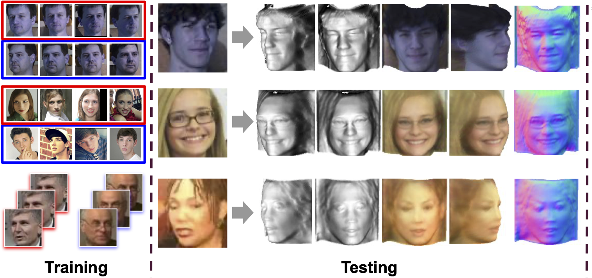

##### Table of Content

1. [Introduction](#toward-realistic-single-view-3d-object-reconstruction-with-unsupervised-learning-from-multiple-images)
1. [Getting Started](#getting-started)
    - [Datasets](#datasets)
    - [Installation](#installation)
1. [Experiments](#experiments)
    - [Training & Testing](#training-and-testing)
    - [Pretrained models](#pretrained-models)
    - [Texture fine-tuning](#texture-fine-tuning)
    - [Demo](#demo)


# Toward Realistic Single-View 3D Object Reconstruction with Unsupervised Learning from Multiple Images

Recovering the 3D structure of an object from a single image is a challenging task due to its ill-posed nature. One approach is to utilize the plentiful photos of the same object category to learn a strong 3D shape prior for the object.
We propose a general framework without symmetry constraint, called **LeMul**, that effectively Learns from Multi-image datasets for more flexible and reliable unsupervised training of 3D reconstruction networks. It employs loose shape and texture consistency losses based on component swapping across views.




Details of the model architecture and experimental results can be found in [our following paper](https://arxiv.org/abs/2109.02288).

```
@inproceedings{ho2021lemul,
      title={Toward Realistic Single-View 3D Object Reconstruction with Unsupervised Learning from Multiple Images},
      author={Long-Nhat Ho and Anh Tran and Quynh Phung and Minh Hoai},
      booktitle={Proceedings of the IEEE/CVF International Conference on Computer Vision},
      year={2021}
}
```
**Please CITE** our paper whenever our model implementation is used to help produce published results or incorporated into other software.

## Getting Started

### Datasets
1. [CelebA](http://mmlab.ie.cuhk.edu.hk/projects/CelebA.html) face dataset. Please download the original images (`img_celeba.7z`) from their [website](http://mmlab.ie.cuhk.edu.hk/projects/CelebA.html) and run `celeba_crop.py` in `data/` to crop the images.
2. Synthetic face dataset generated using [Basel Face Model](https://faces.dmi.unibas.ch/bfm/). This can be downloaded using the script `download_synface.sh` provided in `data/`.
3. Cat face dataset composed of [Cat Head Dataset](http://academictorrents.com/details/c501571c29d16d7f41d159d699d0e7fb37092cbd) and [Oxford-IIIT Pet Dataset](http://www.robots.ox.ac.uk/~vgg/data/pets/) ([license](https://creativecommons.org/licenses/by-sa/4.0/)). This can be downloaded using the script `download_cat.sh` provided in `data/`.
4. [CASIA WebFace dataset](https://arxiv.org/abs/1411.7923v1). You can download the original dataset from backup links such as the Google Drive link on this [page](https://github.com/happynear/AMSoftmax/issues/18). Decompress, and run `casia_data_split.py` in `data/` to re-organize the images.

Please remember to cite the corresponding papers if you use these datasets.

### Installation:
```
# clone the repo
git clone https://github.com/VinAIResearch/LeMul.git
cd LeMul

# install dependencies
conda env create -f environment.yml
```


## Experiments
### Training and Testing
Check the configuration files in `experiments/` and run experiments, eg:
```
# Training
python run.py --config experiments/train_multi_CASIA.yml --gpu 0 --num_workers 4

# Testing
python run.py --config experiments/test_multi_CASIA.yml --gpu 0 --num_workers 4
```

### Texture fine-tuning
With collection-style datasets such as CASIA, you can fine-tune the texture estimation network after training. Check the configuration file `experiments/finetune_CASIA.yml` as an example. You can run it with the command:
```
python run.py --config experiments/finetune_CASIA.yml --gpu 0 --num_workers 4
```

### Pretrained Models
Pretrained models can be found here: [Google Drive](https://drive.google.com/drive/folders/1-AI_JRv6vR4k0p_jdasrQhxg9PywvreF)
Please download and place pretrained models in `./pretrained` folder.

### Demo
After downloading pretrained models and preparing input image folder, you can run demo, eg:
```
python demo/demo.py --input demo/human_face_cropped --result demo/human_face_results --checkpoint pretrained/casia_checkpoint028.pth
```

*Options*:
- `--config path-to-training-config-file.yml`: input the config file used in training (recommended)
- `--detect_human_face`: enable automatic human face detection and cropping using MTCNN. You need to install [facenet-pytorch](https://github.com/timesler/facenet-pytorch) before using this option. This only works on human face images
- `--gpu`: enable GPU
- `--render_video`: render 3D animations using [neural_renderer](https://github.com/daniilidis-group/neural_renderer) (GPU is required)

To replicate the results reported in the paper with the model pretrained on the CASIA dataset, use the `--detect_human_face` option with images in folder `demo/images/human_face` and skip that flag with images in `demo/images/human_face_cropped`.
