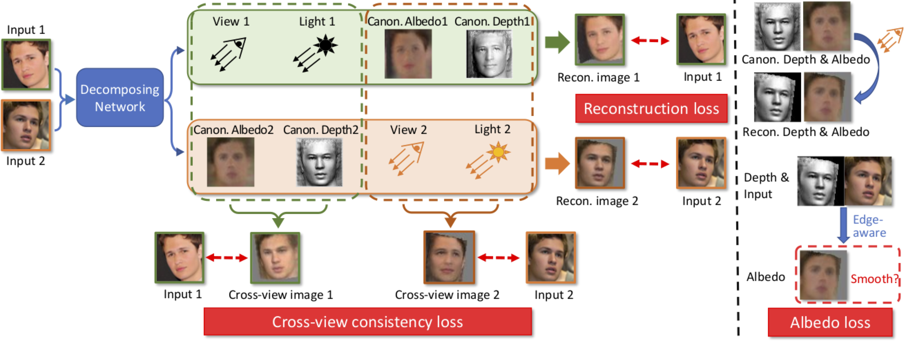

# Toward Realistic Single-View 3D Object Reconstruction with Unsupervised Learning from Multiple Images - ICCV 2021

We propose a more general framework, called LeMul, that effectively Learns from Multi-image datasets for more flexible and reliable unsupervised training of 3D reconstruction networks. It employs loose shape and texture consistency losses based on component swapping across views.




Details of the dataset construction, model architecture, and experimental results can be found in [our following paper]().

```
@inproceedings{
}
```
**Please CITE** our paper whenever our datasets or model implementation is used to help produce published results or incorporated into other software.

## Getting Started

### Installation:
```
# clone the repo
git clone https://github.com/VinAIResearch/LeMul.git
cd LeMul

# install dependencies
conda env create -f environment.yml
```

### Datasets
1. [Multi-PIE](https://www.cs.cmu.edu/afs/cs/project/PIE/MultiPie/Multi-Pie/Home.html) multi-view human-face dataset captured in studio settings.
2. [CelebA](http://mmlab.ie.cuhk.edu.hk/projects/CelebA.html) face dataset.
3. BFM dataset generated using [Basel Face Model](https://faces.dmi.unibas.ch/bfm/).
4. Cat face dataset composed of [Cat Head Dataset](http://academictorrents.com/details/c501571c29d16d7f41d159d699d0e7fb37092cbd) and [Oxford-IIIT Pet Dataset](http://www.robots.ox.ac.uk/~vgg/data/pets/) ([license](https://creativecommons.org/licenses/by-sa/4.0/)).

These can be found here: [Google drive]()

Please download and place desired dataset in `./data/` folder.

Please remember to cite the corresponding papers if you use these datasets.


### Pretrained Models
Pretrained models can be found here: [Google drive]()
Please download and place pretrained models in `./pretrained` folder.

### Demo
```
python demo/demo.py --input demo/images/human_face --result demo/results/human_face --checkpoint pretrained/pretrained_multiPIE/checkpoint004.pth
```

*Options*:
- `--gpu`: enable GPU
- `--render_video`: render 3D animations using [neural_renderer](https://github.com/daniilidis-group/neural_renderer) (GPU is required)


### Training and Testing
Check the configuration files in `experiments/` and run experiments, eg:
```
# Training
python run.py --config experiments/train_BFM.yml --gpu 0 --num_workers 4

# Testing
python run.py --config experiments/test_BFM.yml --gpu 0 --num_workers 4
```

### Acknowledgement
Special thanks to [Unsup3d](https://elliottwu.com/projects/unsup3d/) for inspiring us much, and for the source code too.
